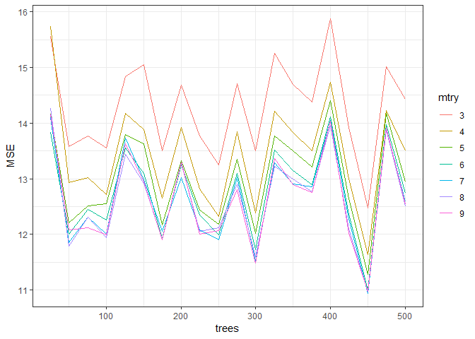

Homework 4: Bags, Forests, Boosts, oh my
================
Alex Boyce
3/9/2019

Problem 1
---------

Problem 7 from Chapter 8 in the text. To be specific, please use a sequence of `ntree` from 25 to 500 in steps of 25 and `mtry` from 3 to 9 for by 1.

Answer 1
--------

``` r
set.seed(1)
df <- tbl_df(Boston)
inTraining <- createDataPartition(df$medv, p = .75, list = F)
training <- df[inTraining, ]
testing  <- df[-inTraining, ]

set.seed(1)
results <- tibble(trees = rep(seq(25,500,by=25), each=7),
                  mtry = rep(3:9, each=1,times=20),
                  RMSE = rep(NA, length(trees)))

set.seed(1)
for (i in seq(25, 50, by=25)){
  rf_results <- train(medv ~ ., 
                      data = training,
                      method = "rf",
                      ntree = i,
                      importance = T,
                      tuneGrid = data.frame(mtry = seq(3,9,by=1)))
  for (j in seq(1,7)){
    results[j + (i/25 - 1)*7,'RMSE'] = rf_results$results$RMSE[j]
    }
}

p <- ggplot(data = results, aes(x = trees, y = RMSE, group=mtry, col=as.factor(mtry)))
p + geom_line() + labs(color = 'mtry')
```

    ## Warning: Removed 126 rows containing missing values (geom_path).



RMSE fluctuates a bit based on the number of trees - 50 looks like a good compromise between time to run and low error. In terms of mtry, RMSE improvement appears to stop at around 5 so that seems like a good option.

Problem 2
---------

Problem 8 from Chapter 8 in the text. Set your seed with 9823 and split into train/test using 50% of your data in each split. In addition to parts (a) - (e), do the following:

Part a - splitting the data

``` r
df <- tbl_df(Carseats)

set.seed(9823)
inTraining <- createDataPartition(df$Sales, p = .5, list = F)
training <- df[inTraining, ]
testing  <- df[-inTraining, ]
```

Part b - regression tree

``` r
tree_carseats <- rpart(Sales ~ . , training)
prp(tree_carseats)
```


``` r
test_pred <- predict(tree_carseats, newdata = testing)
mean((test_pred - testing$Sales)^2)
```

    ## [1] 4.484515

Part c - Tree cross-validation for tree depth

``` r
set.seed(9823)
fit_control <- trainControl(method = "repeatedcv", number = 10, repeats = 10)
cv_carseats_tree <- train(Sales ~ ., training, 
                          method = "rpart2", 
                          trControl = fit_control, 
                          tuneGrid = data.frame(maxdepth = 1:10))
```

    ## Warning in nominalTrainWorkflow(x = x, y = y, wts = weights, info =
    ## trainInfo, : There were missing values in resampled performance measures.

``` r
plot(cv_carseats_tree)
```


``` r
cv_carseats_tree
```

    ## CART 
    ## 
    ## 201 samples
    ##  10 predictor
    ## 
    ## No pre-processing
    ## Resampling: Cross-Validated (10 fold, repeated 10 times) 
    ## Summary of sample sizes: 180, 181, 181, 181, 181, 181, ... 
    ## Resampling results across tuning parameters:
    ## 
    ##   maxdepth  RMSE      Rsquared   MAE     
    ##    1        2.386609  0.2502462  2.002081
    ##    2        2.339570  0.2848321  1.913478
    ##    3        2.205471  0.3687289  1.801573
    ##    4        2.253889  0.3529630  1.835435
    ##    5        2.293972  0.3409969  1.854148
    ##    6        2.318822  0.3369173  1.879146
    ##    7        2.319414  0.3442876  1.872713
    ##    8        2.310316  0.3505416  1.864051
    ##    9        2.305573  0.3579987  1.856158
    ##   10        2.286577  0.3770154  1.822844
    ## 
    ## RMSE was used to select the optimal model using the smallest value.
    ## The final value used for the model was maxdepth = 3.

``` r
set.seed(9823)
cv_carseats_tree3 <- train(Sales ~ ., training, method = "rpart2", maxdepth = 3)

test_pred <- predict(cv_carseats_tree3, newdata = testing)
mean((test_pred - testing$Sales)^2)
```

    ## [1] 4.933184

Part d - Bagging

``` r
set.seed(9823)
carseats_bag <- randomForest(Sales ~ ., data = training, 
                             mtry = ncol(training)-1,
                             ntrees=500,
                             importance=TRUE)

test_pred <- predict(carseats_bag, newdata = testing)
mean((test_pred - testing$Sales)^2)
```

    ## [1] 3.01177

``` r
imp <- varImp(carseats_bag)
rn <- row.names(imp)
imp_df <- data_frame(variable = rn, importance = imp$Overall) %>%
  arrange(desc(-importance)) %>%
  mutate(variable = factor(variable, variable))
```

    ## Warning: `data_frame()` is deprecated, use `tibble()`.
    ## This warning is displayed once per session.

``` r
p <- ggplot(data = imp_df, aes(variable, importance))
p + geom_col(fill = "#6e0000") +
  coord_flip()
```


Part e - Random Forest

``` r
set.seed(9823)
carseats_rf <- train(Sales ~ ., data = training,
                     method = "rf", ntree = 250,
                      importance = T, tuneGrid = data.frame(mtry = 2:10))

p <- ggplot(data = carseats_rf$results, aes(x = mtry, y = RMSE))
p + geom_point() +
  geom_line()
```


``` r
set.seed(9823)
carseats_rf5 <- randomForest(Sales ~ ., data = training, mtry = 5)

test_pred <- predict(carseats_rf5, newdata = testing)
mean((test_pred - testing$Sales)^2)
```

    ## [1] 3.192504

``` r
imp <- varImp(carseats_rf)$importance
rn <- row.names(imp)
imp_df <- data_frame(variable = rn, importance = imp$Overall) %>%
  arrange(desc(-importance)) %>%
  mutate(variable = factor(variable, variable))

p <- ggplot(data = imp_df, aes(variable, importance))
p + geom_col(fill = "#6e0000") +
  coord_flip()
```


1.  Fit a gradient-boosted tree to the training data and report the estimated test MSE.

``` r
set.seed(9823)
grid <- expand.grid(interaction.depth = c(1, 3), 
                    n.trees = seq(0, 2000, by = 100),
                    shrinkage = c(.01, 0.001),
                    n.minobsinnode = 10)

trainControl <- trainControl(method = "cv", number = 5)
carseats_gb <- train(Sales ~ ., 
                     data = training,
                     distribution = "gaussian", 
                     method = "gbm",
                     trControl = trainControl, 
                     tuneGrid = grid,
                     verbose = FALSE)
```

    ## Warning in nominalTrainWorkflow(x = x, y = y, wts = weights, info =
    ## trainInfo, : There were missing values in resampled performance measures.

``` r
test_pred <- predict(carseats_gb, newdata = testing)
mean((test_pred - testing$Sales)^2)
```

    ## [1] 1.816239

1.  Fit a multiple regression model to the training data and report the estimated test MSE

``` r
carseats_lm <- lm(Sales ~ .,data = training)
test_pred <- predict(carseats_lm, newdata = testing)
mean((test_pred - testing$Sales)^2)
```

    ## [1] 1.012709

1.  Summarize your results.

Tree error MSE steadily improved throughout the problem, with the original tree & cross-validation of depth around 4.5-5. Bagging and random forest dropped MSE to around 3, then boosting further dropped to 1.8. However, a simple multiple regression with all variables was still best at 1.01 and is probably the easiest to explain.
